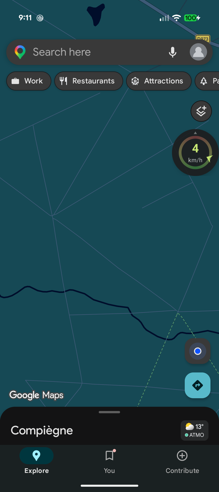
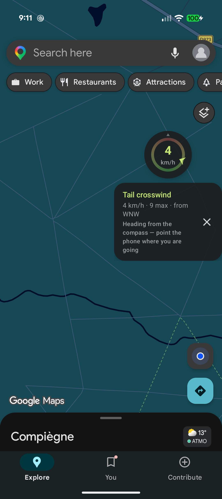
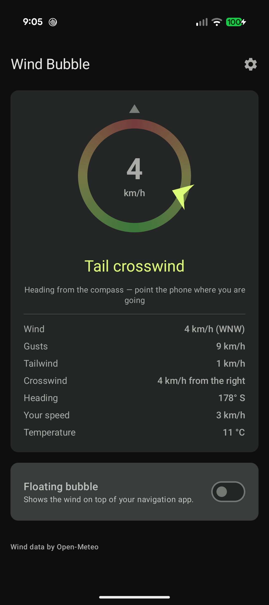
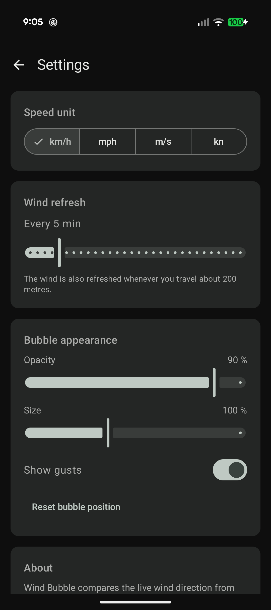

# Wind Bubble

**See where the wind hits you, on top of your navigation app.**

A small dial floats over Komoot, Google Maps, or whatever you ride with, and tells you at a glance
whether the wind is in your face, across, or pushing you along.

<p align="center">
  
  
  
  
</p>

## What it does

**The dial is locked on your heading.** The top is always the direction you are travelling, marked
by the small grey tick. A coloured marker rides the ring at the angle the wind comes from:

* **red** — straight in your face, you are fighting it
* **amber** — across, watch the gusts
* **green** — in your back, enjoy it

The ring itself carries the same gradient, so it doubles as the legend: you never have to remember
what a colour means.

**It works standing still.** Below walking pace the GPS reports no course at all, which is exactly
when you want to know what is coming: at a red light, or before setting off. The phone compass takes
over, so point it down the road you are about to take and the dial answers straight away. The app
always tells you which of the two it is using.

**It stays out of the way.** Drag the bubble anywhere on screen and it remembers the spot. Tap it
for a one-line summary — wind, gusts, and where it blows from — tap the cross to stop it. Size and
opacity are adjustable, so it can be a discreet marker or a proper gauge.

**The numbers you actually want.** Beyond the direction, the dashboard splits the wind into its
head/tail component (what slows you down or helps you) and its crosswind component (with the side it
comes from), plus gusts and temperature. Speeds in km/h, mph, m/s or knots.

**No account, no tracking.** No sign-up, no analytics, no advertising. Your position is rounded to a
coarse grid before being sent to the weather service, and nothing else ever leaves the phone.

The interface follows your phone language — English and French today.

## Install

### F-Droid

*Coming soon — link to be added once the app is accepted.*

### IzzyOnDroid

*Coming soon — link to be added once the app is accepted.*

### Direct download

Grab the latest `.apk` from the [releases page](https://github.com/mickaelmagniez/WindBubble/releases)
and install it. It is signed with the project key, and
[Obtainium](https://github.com/ImranR98/Obtainium) can keep it updated automatically from there.

> Note: the F-Droid build is signed with F-Droid's own key rather than mine, so you cannot switch
> between the F-Droid version and the one from here without uninstalling first. Pick one and stay
> with it.

**Requires Android 8.0 (API 26) or later.** On first launch the app asks for the permissions it
needs, one after the other: location (your heading), notifications, and display over other apps (the
bubble itself). Each is only asked once per session — decline it and the button stays on the home
screen for later.

## Under the hood

### How the wind is computed

The wind direction from the weather service is a compass angle: where the wind blows *from*. Your
heading is a compass angle too. The relative angle is simply their difference, and everything else
falls out of it:

```
relative = windFromDirection − heading
headwind = windSpeed × cos(relative)     // positive slows you down
crosswind = windSpeed × sin(relative)    // positive blows from your right
```

So 0° is a pure headwind, 180° a pure tailwind, and the marker sits at `relative` on the ring.

| Concern | Implementation |
| --- | --- |
| Direction of travel | Platform `LocationManager` course over ground, ignored below 1 m/s and smoothed so the marker does not jitter |
| Standing still | Device compass (fused rotation vector), corrected for magnetic declination, registered only while the GPS gives no course |
| Wind | [Open-Meteo](https://open-meteo.com) current wind at 10 m — free, no API key, no account |
| Refresh | Whenever you leave a ~200 m grid cell, or every N minutes (1–30, default 5), throttled to one request per 20 s |
| Bubble | `TYPE_APPLICATION_OVERLAY` window hosting a `ComposeView`, driven by a `location` foreground service |

No Google Play Services anywhere: location comes from the AOSP `LocationManager`, which keeps the app
free of proprietary dependencies and publishable on F-Droid.

### Architecture

Unidirectional data flow, one shared session, three layers:

```
ui/            Compose Material 3 screens, ViewModels exposing a single StateFlow<UiState>
overlay/       Foreground service + WindowManager overlay hosting the same Compose UI
session/       WindSessionManager: the one shared StateFlow<WindSessionState>
domain/        Models, repository interfaces, ObserveRelativeWindUseCase, CalculateRelativeWind
data/          Retrofit/Open-Meteo, platform location, compass sensor, DataStore preferences
core/          Hilt modules, dispatchers, angle maths
```

`WindSessionManager` shares one cold pipeline with `SharingStarted.WhileSubscribed`, so the GPS, the
compass and the network are only active while the dashboard or the bubble is actually observing it.

### Stack

Kotlin 2.4 · AGP 9.4 (built-in Kotlin) · Jetpack Compose with Material 3 and dynamic colour ·
Navigation Compose (type-safe routes) · Hilt + KSP · Coroutines/Flow · Retrofit 3 +
kotlinx.serialization · DataStore Preferences · JUnit 4 + Truth + Turbine.

`compileSdk 37`, `minSdk 26`, JDK 17+.

### Build

```bash
./gradlew :app:assembleDebug          # APK in app/build/outputs/apk/debug
./gradlew :app:testDebugUnitTest      # unit tests
./gradlew :app:lintDebug              # Android lint
./gradlew installDebug                # install on a connected device
```

Create `local.properties` with `sdk.dir=/path/to/Android/Sdk` if it is missing. `assembleRelease`
works without any signing credentials and produces an unsigned APK, which is what F-Droid builds.

### Releasing

```bash
./scripts/release.sh 1.1.0     # bump, changelog, checks, commit, tag (no push)
```

Pushing the tag runs the release workflow, which refuses a tag that disagrees with the app version,
builds a signed APK and an AAB, verifies the signature, and attaches them to a GitHub Release.
Signing credentials come from the `SIGNING_*` repository secrets.

## Privacy

Coordinates are rounded to a coarse grid before being sent to Open-Meteo, and nothing else leaves the
device: no account, no analytics, no storage beyond your local preferences. Background location is
never requested — the app only runs while you have started it. See [PRIVACY.md](PRIVACY.md).

## Data licence

Weather data by [Open-Meteo.com](https://open-meteo.com), licensed under CC BY 4.0. **The free API is
for non-commercial use only** — monetising the app (paid app, subscription or ads) requires a
commercial Open-Meteo plan.

## A note on how this was built

This project was written with the help of an AI coding assistant. Every feature was reviewed and
tested on a real device before being committed, but you should read the code with the same healthy
scepticism you would apply to any other codebase.

## Licence

[GPL-3.0](LICENSE).
